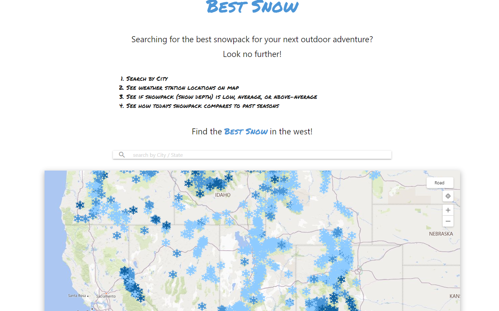
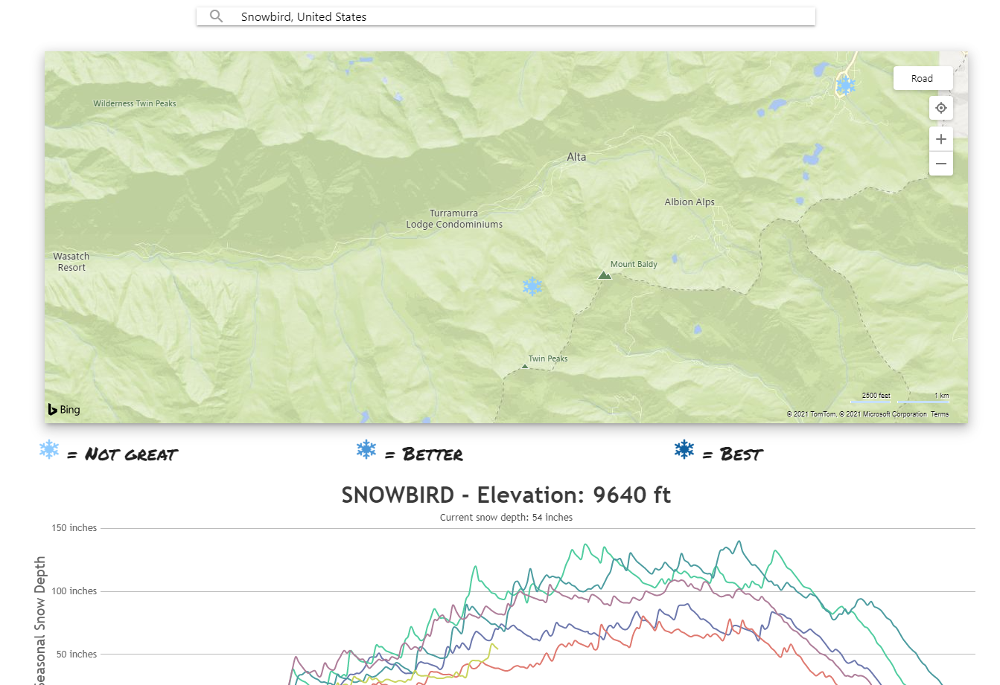
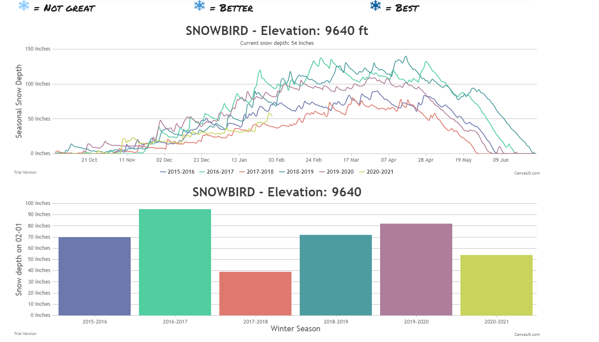

# Best Snow

This app will use the [Powderlines API](http://powderlin.es/api.html) to retrieve snow data for requested SNOTEL stations. The [Bing Maps API](https://www.bing.com/api/maps/sdk/mapcontrol/isdk/Overview) then shows the SNOTEL stations on a map with snowflake icons representing each station.
## Description

When a user initiates the webpage, they can click on any snowflake on the map and the Powderlines free API for accessing SNOTEL station data will find current snow levels in the station selected. The color of the snowflake represents if the snow level is below average, average, or above average (the darker the snowflake, the higher the snow level). Once you click on a station the following information is provided below the map: the name of the station, elevation, and snow depth. This is also shown in two different graphs, the first shows seasonal snow depth and the second shows snow depth on that day from 2015-Present. 

## Built With
* [Materialize CSS](https://materializecss.com/)
* [JQuery](https://jquery.com/)
* [Google Fonts](https://fonts.google.com/)
* [Font Awesome](https://fontawesome.com/)
* [Favicon](https://favicon.io/)
* [CanvasJS](https://canvasjs.com/)
* [MomentJS](https://momentjs.com/)

## Link to Site

[Click to access Best Snow](https://ryanhadfield.github.io/Best-Snow/)

## Screenshots

---

---

## Authors

### Paul Vatterott
[Github](https://github.com/pfvatterott)  
Email: pfvatterott@gmail.com

### Ryan Hadfield
[Github](https://github.com/ryanhadfield)  
Email: ryan.hadfield@gmail.com

### Asher Pappas
[Github](https://github.com/AsherPappas)  
Email: asherpappas@gmail.com

## License
MIT License

Copyright (c) 2021 Paul Vatterott, Ryan Hadfield, Asher Pappas

Permission is hereby granted, free of charge, to any person obtaining a copy of this software and associated documentation files (the "Software"), to deal in the Software without restriction, including without limitation the rights to use, copy, modify, merge, publish, distribute, sublicense, and/or sell copies of the Software, and to permit persons to whom the Software is furnished to do so, subject to the following conditions:

The above copyright notice and this permission notice shall be included in all copies or substantial portions of the Software.

THE SOFTWARE IS PROVIDED "AS IS", WITHOUT WARRANTY OF ANY KIND, EXPRESS OR IMPLIED, INCLUDING BUT NOT LIMITED TO THE WARRANTIES OF MERCHANTABILITY, FITNESS FOR A PARTICULAR PURPOSE AND NONINFRINGEMENT. IN NO EVENT SHALL THE AUTHORS OR COPYRIGHT HOLDERS BE LIABLE FOR ANY CLAIM, DAMAGES OR OTHER LIABILITY, WHETHER IN AN ACTION OF CONTRACT, TORT OR OTHERWISE, ARISING FROM, OUT OF OR IN CONNECTION WITH THE SOFTWARE OR THE USE OR OTHER DEALINGS IN THE SOFTWARE.

